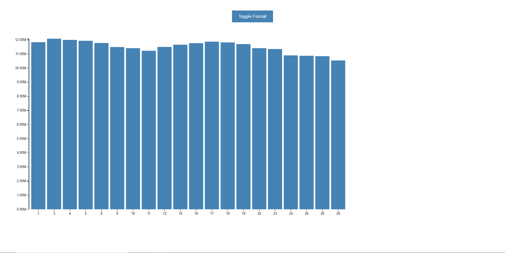
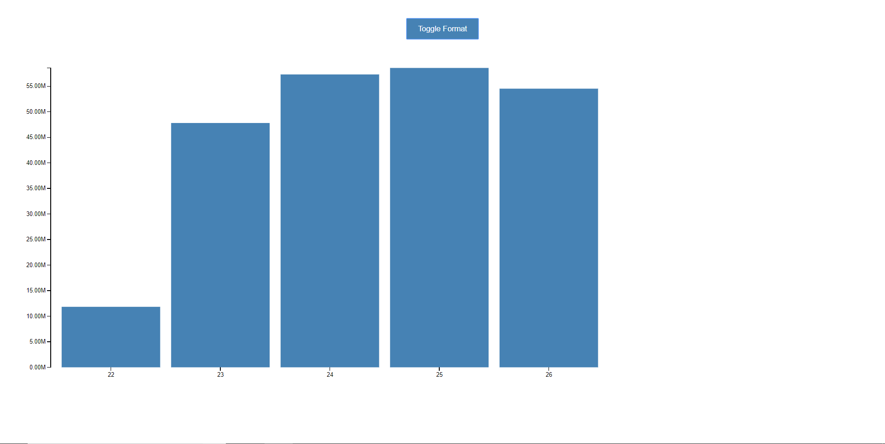

# Daily inventory
Sample webpage showing graphs plotted on d3.js loaded through vue.js. Backend is served using express.js as the web framework built on top of node.js and postgresql database.

## Steps to run the server:

1. start your local postgresql server and set ENV variables or create settings in your local postgresql as defined in `config/db.js`. 
2. create a database and set the database name accordindly.
3. run `npm install` from the root directory
4. run `npm run seed` to create the table and populate data from the csv file
5. run `npm run dev` to start the server
6. load the site on `localhost:8000` to see the output

**Note:** 
1. Local versions used for dev: node.js(8.9.4), npm(5.8.0), postgresql(9.5)

## Screenshots:

### Day view:

### Week view:

